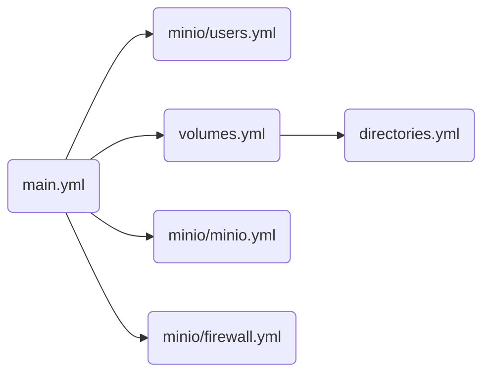

# Flow
  

```mermaid  
graph LR  
main.yml(main.yml) --> minio/users.yml(minio/users.yml)  
main.yml(main.yml) --> volumes.yml(volumes.yml)  
main.yml(main.yml) --> minio/minio.yml(minio/minio.yml)  
main.yml(main.yml) --> minio/firewall.yml(minio/firewall.yml)  
volumes.yml(volumes.yml) --> directories.yml(directories.yml)  
```